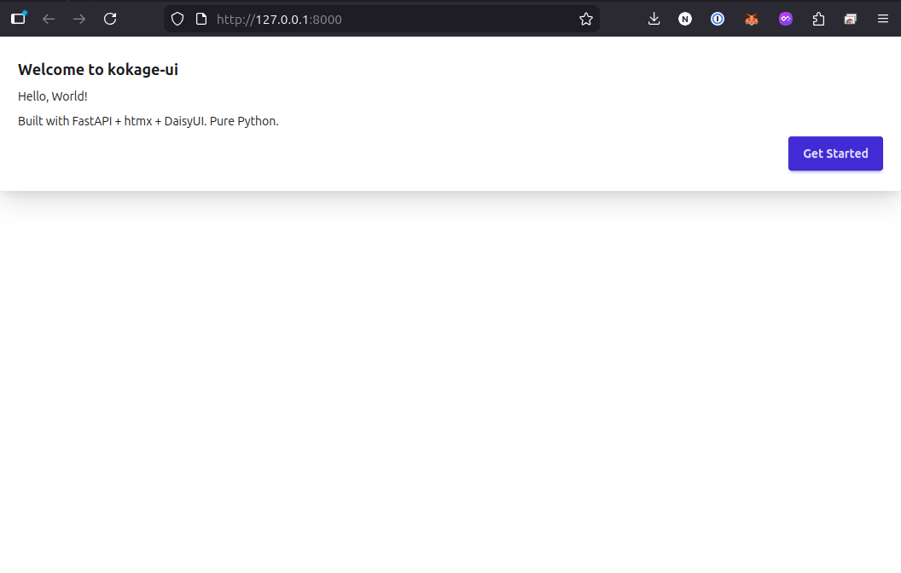

[](https://pypi.org/project/kokage-ui/)
[](https://www.python.org/)
[](LICENSE)

**Add beautiful UI to FastAPI with pure Python. No JavaScript, no templates, no frontend build step.**

## Quick Start

```bash
pip install kokage-ui
```

```python
from fastapi import FastAPI
from kokage_ui import KokageUI, Page, Card, H1, P, DaisyButton

app = FastAPI()
ui = KokageUI(app)

@ui.page("/")
def home():
    return Page(
        Card(
            H1("Hello, World!"),
            P("Built with FastAPI + htmx + DaisyUI. Pure Python."),
            actions=[DaisyButton("Get Started", color="primary")],
            title="Welcome to kokage-ui",
        ),
        title="Hello App",
    )
```

```bash
uvicorn hello:app --reload
```

Please open [http://localhost:8000](http://localhost:8000) in your browser.




## CRUD in 10 Lines

Define a Pydantic model and get full CRUD UI automatically:

```python
from fastapi import FastAPI
from pydantic import BaseModel, Field
from kokage_ui import KokageUI, InMemoryStorage

app = FastAPI()
ui = KokageUI(app)

class Todo(BaseModel):
    id: str = ""
    title: str = Field(min_length=1)
    done: bool = False

ui.crud("/todos", model=Todo, storage=InMemoryStorage(Todo))
```

This single `ui.crud()` call generates list, create, detail, edit, and delete pages with search and pagination — all styled with DaisyUI.

https://github.com/user-attachments/assets/4c4ad3be-664d-432e-9c2e-23e80755b461

## Streaming Chat UI

Build an LLM chat interface with SSE streaming in a few lines:

```python
from fastapi import FastAPI
from kokage_ui import KokageUI

app = FastAPI()
ui = KokageUI(app)

@ui.chat("/chat")
async def chat(message: str):
    async for token in your_llm(message):  # OpenAI, Anthropic, etc.
        yield token
```

`ui.chat()` auto-generates the page with DaisyUI chat bubbles, SSE streaming, Markdown rendering, and code highlighting.

https://github.com/user-attachments/assets/d14d487c-a694-4159-9486-24caccb77a9b

## AI Agent View

Build an agent dashboard with tool call visualization:

```python
from fastapi import FastAPI
from kokage_ui import KokageUI
from kokage_ui.ai import AgentEvent

app = FastAPI()
ui = KokageUI(app)

@ui.agent("/agent")
async def agent(message: str):
    yield AgentEvent(type="tool_call", call_id="1", tool_name="search", tool_input=message)
    result = await your_tool(message)
    yield AgentEvent(type="tool_result", call_id="1", result=result)
    async for token in your_llm(message, result):
        yield AgentEvent(type="text", content=token)
    yield AgentEvent(type="done", metrics={"tokens": 150, "tool_calls": 1})
```

`ui.agent()` renders a full agent UI with status bar, collapsible tool call panels, streaming Markdown, and execution metrics.

## Features

- **50+ HTML Elements** — `Div`, `H1`, `Form`, `Input`, etc. as Python classes
- **25+ DaisyUI Components** — `Card`, `Hero`, `NavBar`, `Modal`, `Tabs`, `Accordion`, `Toast`, `Layout`, and more
- **Pydantic → UI** — Auto-generate forms, tables, detail views from `BaseModel`
- **One-line CRUD** — `ui.crud("/users", model=User, storage=storage)`
- **DataGrid** — Sortable, filterable table with pagination, bulk actions, CSV export
- **Admin Dashboard** — Django-like admin panel: `AdminSite(app).register(User, storage=s)`
- **Auth UI** — `LoginForm`, `RegisterForm`, `UserMenu`, `RoleGuard`, `@protected` decorator
- **Theme System** — `DarkModeToggle` and `ThemeSwitcher` with localStorage persistence
- **Real-time Notifications** — SSE-based push notifications via `Notifier` + `NotificationStream`
- **SQLModel Storage** — Async database persistence with `SQLModelStorage`
- **htmx Patterns** — `AutoRefresh`, `SearchFilter`, `InfiniteScroll`, `SSEStream`, `ConfirmDelete`
- **Charts & Markdown** — `Chart` (Chart.js), `CodeBlock` (Highlight.js), `Markdown`
- **Multi-step Forms** — `MultiStepForm` with step validation
- **CLI Scaffolding** — `kokage-ui init myapp` to generate project templates
- **XSS Protection** — Output escaped via `markupsafe` by default

## CLI

Scaffold a new project in seconds:

```bash
uvx kokage-ui init myapp                    # Minimal app with Card
uvx kokage-ui init myapp -t crud            # CRUD app with model & storage
uvx kokage-ui init myapp -t admin           # Admin dashboard with SQLite
uvx kokage-ui init myapp -t dashboard       # KPI stats & Chart.js charts
uvx kokage-ui init myapp -t chat            # AI chat with SSE streaming
uvx kokage-ui init myapp -t agent           # AI agent with tool execution
```

Add pages and models to an existing project:

```bash
uvx kokage-ui add page dashboard            # Add a new page
uvx kokage-ui add crud Product              # Add CRUD model
uvx kokage-ui templates                     # List all available templates
```

## Examples

| Example | Description | Run |
|---|---|---|
| [hello.py](examples/hello.py) | Minimal app | `uvicorn examples.hello:app` |
| [todo.py](examples/todo.py) | CRUD todo app | `uvicorn examples.todo:app` |
| [dashboard.py](examples/dashboard.py) | Full dashboard | `uvicorn examples.dashboard:app` |
| [admin_demo.py](examples/admin_demo.py) | Admin panel (SQLite) | `uvicorn examples.admin_demo:app` |
| [auth_demo.py](examples/auth_demo.py) | Auth + Admin | `uvicorn examples.auth_demo:app` |
| [blog.py](examples/blog.py) | Markdown + Charts + Tabs | `uvicorn examples.blog:app` |
| [realtime.py](examples/realtime.py) | SSE notifications | `uvicorn examples.realtime:app` |
| [chat_demo.py](examples/chat_demo.py) | Streaming chat UI | `uvicorn examples.chat_demo:app` |
| [agent_demo.py](examples/agent_demo.py) | AI agent with tools | `uvicorn examples.agent_demo:app` |
| [chart_demo.py](examples/chart_demo.py) | Chart.js 6 chart types | `uvicorn examples.chart_demo:app` |

## Documentation

For detailed guides, component reference, and API docs, see the [full documentation](https://neka-nat.github.io/kokage-ui/).

## License

MIT
